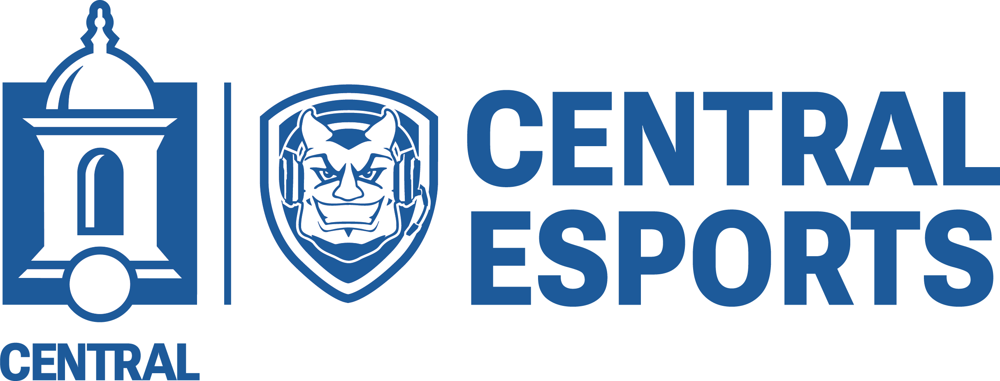

## Assets Folder
This folder contains all the assets utilized in the varsity esports streams.

During setup of OBS, you can direct the install to check this folder and it should find all the files.

## Upcoming changes
> [!IMPORTANT]
> We are expecting a new Central Esports logo in the coming weeks/months from marketing to shift away from "CCSU" based logos to reflect the new "Central" branding. When that gets delivered, we will update the repository to reflect the changes. The current logo (as seen above) will be renamed as esports-old.png and will remain in the repo.

## Credits
- [All Central Logos](https://www.ccsu.edu/mc/brand-resources)
- Esports Center Background - Credit to Dylan
- [OW2 Logo](https://overwatch.blizzard.com/en-us/)
- [VAL Logo](https://playvalorant.com/en-us/)
